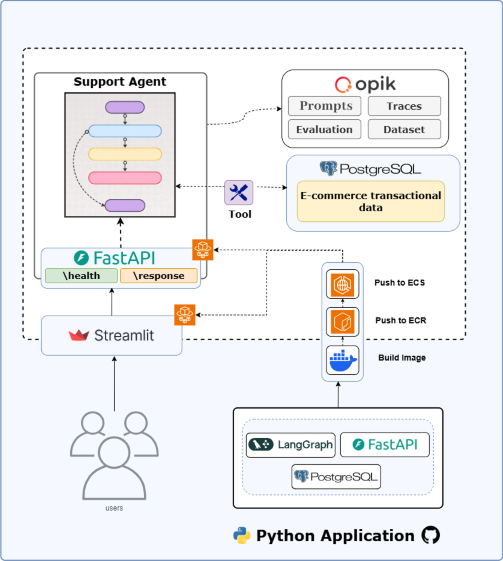

# Customer Support Agent

### Live Link: https://support-ai-agent.streamlit.app/

## Architecture

<p align="center">
  
</p>

---

## About the project:

An AI-powered customer support agent that understands customer emails, extracts intent, generates and executes SQL when required, and drafts a resolved response email. The system is built with a clean separation between UI, API, and agent logic, and is production-ready for containerized deployment.
Evaluated agent against evaluation dataset and improved agent performance using SQL Reflection with execution output as external feedback.

---

## 📂 Folder Structure

```
backend-api/                   # backend api (agent)
    ├── tools/                 # Entrypoint scripts (run or evaluate agent)
    ├── data/                  # Data files (evaluation dataset)
    ├── src/                   # Main package directory
    │   ├── application/       # Application layer
    │   ├── infrastructure/    # Infrastructure layer
    │   └── config.py          # Configuration settings
    ├── .env.example           # Environment variables template
    ├── .python-version        # Python version specification
    ├── Dockerfile             # API Docker image definition
    └── pyproject.toml         # Project dependencies
```

## 🧪 Observability & Evaluation

* Prompt versioning and traces using **Opik**
* SQL generation evaluation using expected SQL/output scoring

---

## 🩺 API Endpoints

* `GET /health` → Service health check
* `POST /response` → Agent response for customer email

---

## 📦 Deployment

* Dockerized backend
* Image pushed to **AWS ECR**
* Deployed via **AWS ECS (Fargate / EC2)**

---

## 🧠 Tech Stack

* Python, FastAPI
* Streamlit
* LangGraph, LLM APIs
* PostgreSQL
* Docker, AWS ECS

---

